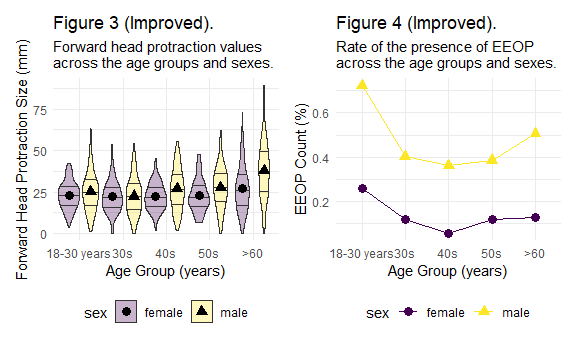

P8105 Midterm
================
Mengfan Luo (ml4701)
10/30/2021

### 1. Data

``` r
# Load and clean variable names
eop_df = read_excel("p8105_mtp_data.xlsx",range = "A9:I1230") %>% 
  janitor::clean_names() %>% 
  rename(eop_visibility = eop_visibility_classification) %>% 
  filter((age>=18)&(age<=86)) %>% 
  #Participants should age between 18 to 86
  mutate(
    eop_size_mm = str_replace_na(eop_size_mm,"0"), 
    # Filled missing values in eop_size
    
    #data type conversion
    sex = factor(sex),
    sex = recode(sex,"0" = "female", "1" = "male"),
    
    age_group = fct_inseq(age_group,ordered = TRUE),
    eop_size_mm = as.numeric(eop_size_mm),
    eop_size = fct_inseq(eop_size,ordered = TRUE),
    eop_visibility = fct_inseq(factor(eop_visibility),ordered = TRUE),
    eop_shape = factor(eop_shape),
    fhp_category = fct_inseq(fhp_category,ordered = TRUE))
```

**Data cleaning process**

-   Variable names converted to lower\_snake\_case

-   Missing values in `eop_size_mm` filled with `0` as indicated in
    header information

-   Remove age &lt;18 and &gt;86 as indicated by the report

-   Datatype conversion for selected variables

The resulting dataset has 1217 rows and 9 columns, (6 factors and 3
numeric variables). Based on the original scientific report,

**Key variables:**

-   `sex`: factor with 2 unordered levels female, male
-   `age`: integers with range \[18, 86\]
-   `age_group`: divided according to decades. 8 ascending levels 1, 2,
    3, 4, 5, 6, 7, 8
-   `eop_size_mm`: numeric variable with range \[0, 35.7\].
-   `eop_size`: ordered factor encoded from `eop_size_mm` with 7
    ascending levels 0, 1, 2, 3, 4, 5, 14.6 (“14.6” seems to be a typo).
-   `fhp_size_mm`: numeric variable with range \[0, 89.3\], has 6
    missing values.
-   `fhp_category`: ordered factor encoded from `fhp_size_mm` with 9
    ascending levels 0, 1, 2, 3, 4, 5, 6, 7, 30.8.

A total of 1217 participants are included.

Age and gender distribution are displayed with following table and plot:

``` r
age_group_renewed = eop_df  %>% 
mutate(
    age_group = case_when(
      age <= 30 ~ "2",
      (age > 30) &(age <= 40) ~ "3",
      (age > 40) &(age <= 50) ~ "4",
      (age > 50) &(age <= 60) ~ "5",
      (age > 60)~ "6"),
    age_group = factor(age_group, levels = c("2","3","4","5","6"),ordered = TRUE, 
                       labels = c("18-30 years","30s","40s","50s",">60"))) 
age_group_renewed %>% 
  janitor::tabyl(age_group,sex) %>% 
  knitr::kable()
```

| age\_group  | female | male |
|:------------|-------:|-----:|
| 18-30 years |    151 |  152 |
| 30s         |    102 |  102 |
| 40s         |    106 |  102 |
| 50s         |     99 |  101 |
| &gt;60      |    154 |  148 |

``` r
age_group_renewed %>%
  group_by(age_group,sex) %>% 
  ggplot(aes(x = age_group,fill = sex))+
  geom_bar(alpha = .7, position=position_dodge())+
  labs(title = "Gender and age distribution of Participants",
       x = "Age group",
       y = "Number of participants")
```


**Issues in the dataset**

-   Definitions of categorical variables were not clear. For example,
    definition for `eop_size` based on `eop_size_mm` was given:

``` r
tibble(
  eop_size = c(0,1,2,3,4,5),
  eop_size_mm = c("0-5","5-10","10-15","15-20","20-25","25+")
) %>% 
  knitr::kable()
```

| eop\_size | eop\_size\_mm |
|----------:|:--------------|
|         0 | 0-5           |
|         1 | 5-10          |
|         2 | 10-15         |
|         3 | 15-20         |
|         4 | 20-25         |
|         5 | 25+           |

But whether dividing points (5,10…) belong to the former or latter
intervals was not specified. In the following table, both 15 and 20 are
categorized into `eop_size == 3`

``` r
eop_df %>% 
  select(eop_size_mm,eop_size) %>%
  filter(eop_size_mm %in% c(15,20)) %>% 
  knitr::kable()
```

| eop\_size\_mm | eop\_size |
|--------------:|:----------|
|            15 | 3         |
|            15 | 3         |
|            20 | 3         |
|            20 | 3         |
|            15 | 14.6      |

-   Categorical variables in the dataset didn’t correctly implement the
    definitions given. Discordance between *given* and *recalculated*
    categorical groups are shown:

``` r
eop_df %>% 
  select(age,age_group) %>%
  mutate(
         age_group_recalculate = case_when(
          age <= 30 ~ "2",
          (age > 30) & (age <= 40) ~ "3",
          (age > 40) & (age <= 50) ~ "4",
          (age > 50) & (age <= 60) ~ "5",
          (age > 60) & (age <= 70) ~ "6",
          (age > 70) & (age <= 80) ~ "7",
           age > 80 ~ "8")) %>% 
  filter(!(age_group == age_group_recalculate)) %>% 
  knitr::kable()
```

| age | age\_group | age\_group\_recalculate |
|----:|:-----------|:------------------------|
|  84 | 7          | 8                       |
|  81 | 7          | 8                       |
|  81 | 7          | 8                       |
|  83 | 7          | 8                       |
|  84 | 7          | 8                       |
|  82 | 7          | 8                       |
|  81 | 7          | 8                       |
|  82 | 7          | 8                       |
|  84 | 7          | 8                       |
|  83 | 7          | 8                       |
|  83 | 7          | 8                       |
|  83 | 7          | 8                       |
|  82 | 7          | 8                       |
|  85 | 7          | 8                       |
|  85 | 7          | 8                       |
|  45 | 1          | 4                       |

``` r
eop_df %>% 
  select(eop_size_mm,eop_size) %>%
  mutate(
         eop_size_recalculate = case_when(
      eop_size_mm <= 5 ~ "0",
      (eop_size_mm > 5 ) &(eop_size_mm <= 10) ~ "1",
      (eop_size_mm > 10) &(eop_size_mm <= 15) ~ "2",
      (eop_size_mm > 15) &(eop_size_mm <= 20) ~ "3",
      (eop_size_mm > 20) &(eop_size_mm <= 25) ~ "4",
      eop_size_mm > 25 ~ "5")) %>% 
  filter(!(eop_size == eop_size_recalculate))%>% 
  knitr::kable()
```

| eop\_size\_mm | eop\_size | eop\_size\_recalculate |
|--------------:|:----------|:-----------------------|
|         33.50 | 4         | 5                      |
|         25.50 | 4         | 5                      |
|         35.00 | 4         | 5                      |
|         29.50 | 4         | 5                      |
|          2.11 | 4         | 0                      |
|         15.00 | 3         | 2                      |
|         15.00 | 3         | 2                      |
|         31.10 | 4         | 5                      |
|         35.70 | 4         | 5                      |
|         25.40 | 4         | 5                      |
|         26.80 | 4         | 5                      |
|         23.50 | 5         | 4                      |
|         22.90 | 5         | 4                      |
|          0.00 | 1         | 0                      |
|         10.00 | 2         | 1                      |
|         15.00 | 14.6      | 2                      |
|         14.60 | 3         | 2                      |
|          5.00 | 1         | 0                      |
|          5.00 | 1         | 0                      |
|          5.00 | 1         | 0                      |
|         12.10 | 3         | 2                      |

### 2. Visualization

-   Improved versions of Figure 3 and 4

``` r
fhp_mean = age_group_renewed %>% 
  group_by(age_group,sex) %>% 
  summarize(fhp_mean = mean(fhp_size_mm,na.rm = TRUE))

fig3 = age_group_renewed %>% 
  ggplot(aes(x = age_group,y = fhp_size_mm))+
  geom_violin(aes(fill = sex),na.rm = TRUE,
              draw_quantiles =c(0.25,0.5,0.75),
              width = 1, position = position_dodge(), 
              alpha = .3,size = .5)+
  geom_point(data = fhp_mean,aes(x = age_group, y = fhp_mean,shape = sex),
              size = 3,alpha = 1, position = position_dodge(width = 1))+
  labs(
    title= "Figure 3 (Improved). ",
    subtitle = "Forward head protraction values \nacross the age groups and sexes.",
       x = "Age Group (years)",
       y = "Forward Head Protraction Size (mm)")

fig4 = age_group_renewed %>% 
  mutate(
    eop_size = case_when(
      eop_size_mm <= 5 ~ 0,
      (eop_size_mm > 5 ) &(eop_size_mm <= 10) ~ 1,
      (eop_size_mm > 10) &(eop_size_mm <= 15) ~ 2,
      (eop_size_mm > 15) &(eop_size_mm <= 20) ~ 3,
      (eop_size_mm > 20) &(eop_size_mm <= 25) ~ 4,
      eop_size_mm > 25 ~ 5),
    eeop = case_when(eop_size <= 1 ~ 0,
                     eop_size > 1 ~1) 
    ) %>%
  group_by(age_group,sex) %>% 
  summarize(group_total = n(),EEOP_count = sum(eeop),
            rate = EEOP_count/group_total) %>% 
  ggplot(aes(x = age_group, y = rate,group = sex,shape = sex,color = sex))+
    geom_point(size = 3)+
    geom_line()+
    labs(
      title= "Figure 4 (Improved). ",
      subtitle = "Rate of the presence of EEOP \nacross the age groups and sexes.",
         x = "Age Group (years)",y = "EEOP Count (%)")

fig3+fig4
```



-   From the following scatter plot, no clear trend is seen either
    accross `age` groups or between `eop_size_mm` and `fhp_size_mm`.
    However, it seems that more males have EOP, especially EEOP than
    females within the same age group.

``` r
age_group_renewed %>% 
  select(age,age_group,sex,eop_size_mm,fhp_size_mm) %>% 
  filter(eop_size_mm >= 5) %>% 
  #Samples with eop_size_mm <= 5mm are filtered as the threshold for recording the size of an EOP was set at 5 mm in the paper.
  drop_na() %>%
  mutate(
    eop_size = case_when(
      eop_size_mm <= 5 ~ 0,
      (eop_size_mm > 5 ) &(eop_size_mm <= 10) ~ 1,
      (eop_size_mm > 10) &(eop_size_mm <= 15) ~ 2,
      (eop_size_mm > 15) &(eop_size_mm <= 20) ~ 3,
      (eop_size_mm > 20) &(eop_size_mm <= 25) ~ 4,
      eop_size_mm > 25 ~ 5),
    eeop = case_when(eop_size <= 1 ~ "non-EEOP",
                     eop_size > 1 ~"EEOP") ) %>%
  ggplot(aes(x = fhp_size_mm,y = eop_size_mm,color = eeop))+
    geom_point(alpha = .6,size = 3)+
    facet_grid(sex~age_group)+
    labs(
      subtitle= "Association between FHP size and EOP size across age and sex groups ",
         x = "FHP size (mm)",y = "EOP size (mm)",color = "EEOP status")
```


### 3. Reproducing reported results

The authors’ stated sample sizes and those calculated from data are,
though similar, not identical except for `50s` groups.

``` r
sample_size_available = age_group_renewed %>% 
  group_by(age_group) %>% 
  summarize(size = n())

tibble(
  age_group = c("18-30 years","30s","40s","50s",">60"),
  from_paper = c(300,200,200,200,300),
  from_data = pull(sample_size_available,size)) %>% 
  knitr::kable()
```

| age\_group  | from\_paper | from\_data |
|:------------|------------:|-----------:|
| 18-30 years |         300 |        303 |
| 30s         |         200 |        204 |
| 40s         |         200 |        208 |
| 50s         |         200 |        200 |
| &gt;60      |         300 |        302 |

Mean and sd of FHP from the paper and data are consistent after
rounding.

``` r
age_group_renewed %>% 
  group_by(sex) %>% 
  summarize(fhp_mean = mean(fhp_size_mm,na.rm = TRUE),
            fhp_sd = sd(fhp_size_mm,na.rm = TRUE))
```

    ## # A tibble: 2 x 3
    ##   sex    fhp_mean fhp_sd
    ##   <fct>     <dbl>  <dbl>
    ## 1 female     23.7   10.6
    ## 2 male       28.4   14.5

``` r
tibble(
  sex = c("male","female"),
  from_paper = c("28±15mm","24±11mm"),
  from_data = c("28.4±14.5mm","23.7±10.6mm")) %>% 
  knitr::kable()
```

| sex    | from\_paper | from\_data  |
|:-------|:------------|:------------|
| male   | 28±15mm     | 28.4±14.5mm |
| female | 24±11mm     | 23.7±10.6mm |

Definition of EEOP: EOP with size exceeded 10 mm, aka `eop_size_mm> 10`
or `eop_size > 1`. Calculating using criteria `eop_size_mm> 10`
directly, the prevalence is 32.1%, similar but not identical to that
reported 33% in the paper.

``` r
eeop_recalculated = age_group_renewed %>% 
  mutate(
    eeop = case_when(eop_size_mm > 10 ~ 1,
                     eop_size_mm <= 10 ~ 0))
sum(pull(eeop_recalculated,eeop))/dim(eeop_recalculated)[1]
```

    ## [1] 0.3212818

Proportion of FHP &gt;40 mm subjects increases with age, and within
`>60` age group is 32.1%, still different but close to the given 34.5%.
The results does show that FHP &gt;40mm may be more common in older
subjects.

``` r
age_group_renewed %>% 
  filter(fhp_size_mm >40) %>% 
  group_by(age_group) %>% 
  summarize(case = n()) %>% 
  left_join(sample_size_available) %>% 
  mutate(proportion = round(case/size,3))%>%   

  ggplot(aes(x = age_group, y = proportion))+
  geom_bar(stat = "identity",alpha = .8)+
  geom_text(aes(label = proportion),nudge_y = 0.01)+
  labs(
    title = "Proportion of FHP >40 mm observed accross age groups",
    x = "Age Group (years)",y = "Proportion")
```

    ## Joining, by = "age_group"


### 4. Discussion

From the above analysis, we find some defects in the data analysis and
results of the original reports. First, Inconsistency and
misclassifications are frequent in the source data. Second, some
statistics and plots presented in the reports are inconsistent with
those recalculated from the data, and detailed description lacked.

Also, the report’s conclusions that EEOP are linked to aberrant postures
resulted from extensive use of hand-held electronics may not bear
further scrutiny, because existing data and results cannot provide such
evidence. Further data such as frequency and duration of hand-held
electronics use may be needed to address this hypothesis.

``` r
wordcountaddin::text_stats("p8105_mtp_ml4701.Rmd")
```

| Method          | koRpus      | stringi       |
|:----------------|:------------|:--------------|
| Word count      | 499         | 459           |
| Character count | 3107        | 3107          |
| Sentence count  | 43          | Not available |
| Reading time    | 2.5 minutes | 2.3 minutes   |
