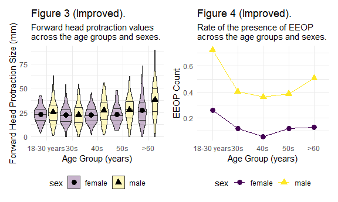

P8105 Midterm
================
Mengfan Luo (ml4701)
10/30/2021

### 1 - Data

``` r
# Load and clean variable names
eop_df = read_excel("p8105_mtp_data.xlsx",range = "A9:I1230") %>% 
  janitor::clean_names() %>% 
  rename(eop_visibility = eop_visibility_classification) %>% 
  mutate(
    eop_size_mm = str_replace_na(eop_size_mm,"0"), # Filled missing values in eop_size
    
    #data type conversion
    sex = factor(sex),
    sex = recode(sex,"0" = "female", "1" = "male"),
    
    age_group = fct_inseq(age_group,ordered = TRUE),
    eop_size_mm = as.numeric(eop_size_mm),
    eop_size = fct_inseq(eop_size,ordered = TRUE),
    eop_visibility = fct_inseq(factor(eop_visibility),ordered = TRUE),
    eop_shape = factor(eop_shape),
    fhp_category = fct_inseq(fhp_category,ordered = TRUE))
```

The following steps are done to clean and tidy up the data:

1.  Columns names are converted to lower snake case

2.  Missing values in `eop_size_mm` are filled with `0` as indicated in
    the original dataset (Yet missing values in `eop_shape` and
    `fhp_size` are kept as `NA` as no such information provided).

3.  `eop_size_mm` is converted to numeric variable;
    `sex`,`eop_shape`,`age_group`, `eop_size`,`eop_visibility` and
    `fhp_category` are converted to factors.

The resulting dataset has 1221 rows and 9 columns. Based on the original
scientific report,

**key variables:**

-   `sex`: gender of participants, factor with 2 unordered levels
    female, male
-   `age`: age of participants, numeric variable with mean 45.5118755
    and range \[17, 88\]
-   `age_group`: age groups divided according to decades. Has 8
    ascending levels 1, 2, 3, 4, 5, 6, 7, 8
-   `eop_size_mm`: size of EOP, numeric variable with mean 6.8330549 and
    range \[0, 35.7\].
-   `eop_size`: ordered factor encoded from `eop_size_mm` with 7
    ascending levels 0, 1, 2, 3, 4, 5, 14.6, where “14.6” seems to be a
    typo in the dataset. *Note: `eop_size` &gt; 1 (`eop_size_mm`&gt; 10)
    were defined as enlarged EOP (EEOP).*
-   `fhp_size_mm`: size of FHP, numeric variable with mean 26.1013416
    and range \[0, 89.3\], has 6 missing values.
-   `fhp_category`: ordered factor encoded from `fhp_size_mm` with 9
    ascending levels 0, 1, 2, 3, 4, 5, 6, 7, 30.8.

**Other variables:**

-   `eop_visibility`: factor with 3 ordered levels 0, 1, 2
-   `eop_shape`: factor with 4 unordered levels 1, 2, 3, 5, has 522
    missing values

Despite 528 missing values, most of them (522) lie in `eop_shape` and is
not key variables in the paper, so a total of 1221 participants are
included.

The age and gender distribution are displayed with following table and
plot:

``` r
eop_df %>% 
  mutate(age_group = recode(age_group,"1" = "<18","2" = "18-30", "3" = "31-40",
                            "4" = "41-50", "5" = "51-60", "6" = "61-70", 
                            "7" = "71-80", "8" = ">80")) %>% 
  janitor::tabyl(age_group,sex) %>% 
  knitr::kable()
```

| age\_group | female | male |
|:-----------|-------:|-----:|
| &lt;18     |      1 |    1 |
| 18-30      |    151 |  152 |
| 31-40      |    102 |  102 |
| 41-50      |    106 |  101 |
| 51-60      |     99 |  101 |
| 61-70      |     89 |   89 |
| 71-80      |     65 |   61 |
| &gt;80     |      1 |    0 |

``` r
eop_df %>%
  mutate(age_group = recode(age_group,"1" = "<18","2" = "18-30", "3" = "31-40",
                            "4" = "41-50", "5" = "51-60", "6" = "61-70", 
                            "7" = "71-80", "8" = ">80")) %>% 
  group_by(age_group,sex) %>% 
  ggplot(aes(x = age_group,fill = sex))+
  geom_bar(alpha = .7, position=position_dodge())+
  labs(title = "Gender and age distribution of Participants",
       x = "Age group",
       y = "Number of participants")
```


There’s some internal inconsistency within the dataset.

1.  Definitions of categorical variables was not clearly specified,
    especially the endpoints of the intervals to partition continuous
    variables. For example, definition for `eop_size` based on
    `eop_size_mm` was given as:

eop\_size\|eop\_size\_mm\|

\|——–:\|:———-\|: \|0 \| 0-5 \| \|1 \| 5-10 \| \|2 \| 10-15 \| \|3 \|
15-20 \| \|4 \| 20-25 \| \|5 \| 25+ \|

But whether dividing points (5,10…) belong to the former or latter group
was not specified, which results in problems shown in the following
table, that both 15 and 20 are categorized into `eop_size` == 3 (and
also a classifications into 14.6)

``` r
eop_df %>% 
  select(eop_size_mm,eop_size) %>%
  filter(eop_size_mm %in% c(15,20)) %>% 
  knitr::kable()
```

| eop\_size\_mm | eop\_size |
|--------------:|:----------|
|            15 | 3         |
|            15 | 3         |
|            20 | 3         |
|            20 | 3         |
|            15 | 14.6      |

2.  Categorical variables in the dataset didn’t correctly implement the
    definitions given. Some discordence between the *given categorical
    groups* and *recalculated groups* are shown in the following tables:

``` r
eop_df %>% 
  select(age,age_group) %>%
  mutate(
         age_group_recalculate = case_when(
          age <= 17 ~ "1",
          (age > 17) & (age <= 30) ~ "2",
          (age > 30) & (age <= 40) ~ "3",
          (age > 40) & (age <= 50) ~ "4",
          (age > 50) & (age <= 60) ~ "5",
          (age > 60) & (age <= 70) ~ "6",
          (age > 70) & (age <= 80) ~ "7",
           age > 80 ~ "8")) %>% 
  filter(!(age_group == age_group_recalculate)) %>% 
  knitr::kable()
```

| age | age\_group | age\_group\_recalculate |
|----:|:-----------|:------------------------|
|  84 | 7          | 8                       |
|  81 | 7          | 8                       |
|  81 | 7          | 8                       |
|  83 | 7          | 8                       |
|  84 | 7          | 8                       |
|  82 | 7          | 8                       |
|  81 | 7          | 8                       |
|  82 | 7          | 8                       |
|  84 | 7          | 8                       |
|  87 | 7          | 8                       |
|  87 | 7          | 8                       |
|  83 | 7          | 8                       |
|  83 | 7          | 8                       |
|  88 | 7          | 8                       |
|  83 | 7          | 8                       |
|  82 | 7          | 8                       |
|  85 | 7          | 8                       |
|  85 | 7          | 8                       |
|  45 | 1          | 4                       |

``` r
eop_df %>% 
  select(eop_size_mm,eop_size) %>%
  mutate(
         eop_size_recalculate = case_when(
      eop_size_mm <= 5 ~ "0",
      (eop_size_mm > 5 ) &(eop_size_mm <= 10) ~ "1",
      (eop_size_mm > 10) &(eop_size_mm <= 15) ~ "2",
      (eop_size_mm > 15) &(eop_size_mm <= 20) ~ "3",
      (eop_size_mm > 20) &(eop_size_mm <= 25) ~ "4",
      eop_size_mm > 25 ~ "5")) %>% 
  filter(!(eop_size == eop_size_recalculate))%>% 
  knitr::kable()
```

| eop\_size\_mm | eop\_size | eop\_size\_recalculate |
|--------------:|:----------|:-----------------------|
|         33.50 | 4         | 5                      |
|         25.50 | 4         | 5                      |
|         35.00 | 4         | 5                      |
|         29.50 | 4         | 5                      |
|          2.11 | 4         | 0                      |
|         15.00 | 3         | 2                      |
|         15.00 | 3         | 2                      |
|         31.10 | 4         | 5                      |
|         35.70 | 4         | 5                      |
|         25.40 | 4         | 5                      |
|         26.80 | 4         | 5                      |
|         23.50 | 5         | 4                      |
|         22.90 | 5         | 4                      |
|          0.00 | 1         | 0                      |
|         10.00 | 2         | 1                      |
|         15.00 | 14.6      | 2                      |
|         14.60 | 3         | 2                      |
|          5.00 | 1         | 0                      |
|          5.00 | 1         | 0                      |
|          5.00 | 1         | 0                      |
|         12.10 | 3         | 2                      |

### 2 - Visualizatio

In the original scientific report, Figures 3 and 4 show data or derived
quantities. Both are flawed. Figure 3 shows only the mean and standard
deviation for FHP, but does not show the distribution of the underlying
data. Figure 4 shows the number of participants in each age and sex
group who have an enlarged EOP (based on categorical EOP Size – groups 0
and 1 vs groups 2, 3, 4, and 5). However, the number of participants in
each age and sex group was controlled by the researchers, so the number
with enlarged EOP in each group is not as informative as the rate of
enlarged EOP in each group. Create a two-panel figure that contains
improved versions of both of these. Although the authors are interested
in how FHP size, age, and sex affect EOP size, no figure contains each
of these. Create a 2 x 5 collection of panels, which show the
association between FHP size and EOP size in each age and sex group.
Comment on your plots with respect to the scientific question of
interest.

``` r
fhp_mean = eop_df %>% 
  filter(age >= 18) %>% 
  mutate(
    age_group = case_when(
      age <= 30 ~ "2",
      (age > 30) &(age <= 40) ~ "3",
      (age > 40) &(age <= 50) ~ "4",
      (age > 50) &(age <= 60) ~ "5",
      (age > 60)~ "6"),
    age_group = factor(age_group, levels = c("2","3","4","5","6"),ordered = TRUE, 
                       labels = c("18-30 years","30s","40s","50s",">60"))) %>% 
  group_by(age_group,sex) %>% 
  summarize(fhp_mean = mean(fhp_size_mm,na.rm = TRUE))
```

    ## `summarise()` has grouped output by 'age_group'. You can override using the `.groups` argument.

``` r
eop_df %>% 
  filter(age >= 18) %>% 
  mutate(
    age_group = case_when(
      age <= 30 ~ "2",
      (age > 30) &(age <= 40) ~ "3",
      (age > 40) &(age <= 50) ~ "4",
      (age > 50) &(age <= 60) ~ "5",
      (age > 60)~ "6"),
    age_group = factor(age_group, levels = c("2","3","4","5","6"),ordered = TRUE, 
                       labels = c("18-30 years","30s","40s","50s",">60"))) %>% 
  ggplot(aes(x = age_group,y = fhp_size_mm))+
  geom_violin(aes(fill = sex),draw_quantiles =c(0.25,0.5,0.75), alpha = .5)+
  geom_point(data = fhp_mean,aes(x = age_group, y = fhp_mean, color = sex))+
  stat_summary(fun = "mean", color = "blue")+
  labs(
    title= "Figure 3 (Improved). ",
    subtitle = "Forward head protraction values across the age groups and sexes.",
       x = "Age Group (years)",
       y = "Forward Head Protraction Size (mm)")
```

    ## Warning: Removed 6 rows containing non-finite values (stat_ydensity).

    ## Warning: Removed 6 rows containing non-finite values (stat_summary).

    ## Warning: Removed 5 rows containing missing values (geom_segment).



``` r
wordcountaddin::text_stats("p8105_mtp_ml4701.Rmd")
```

    ## For information on available language packages for 'koRpus', run
    ## 
    ##   available.koRpus.lang()
    ## 
    ## and see ?install.koRpus.lang()

    ## 
    ## Attaching package: 'koRpus'

    ## The following object is masked from 'package:readr':
    ## 
    ##     tokenize

| Method          | koRpus    | stringi       |
|:----------------|:----------|:--------------|
| Word count      | 605       | 527           |
| Character count | 3471      | 3470          |
| Sentence count  | 49        | Not available |
| Reading time    | 3 minutes | 2.6 minutes   |
